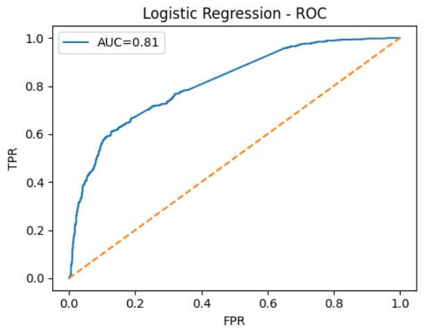
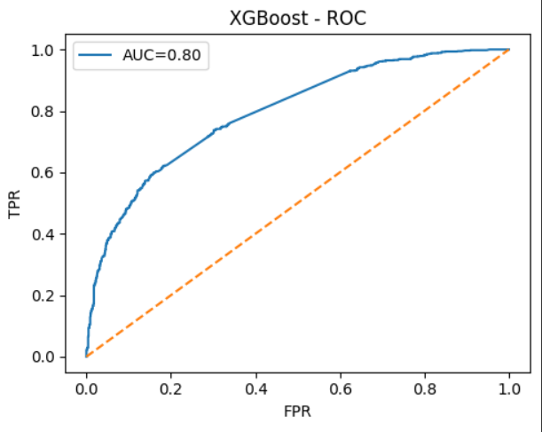
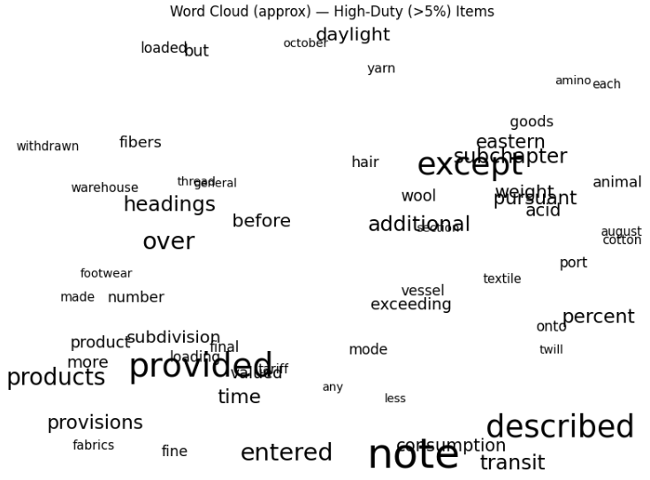
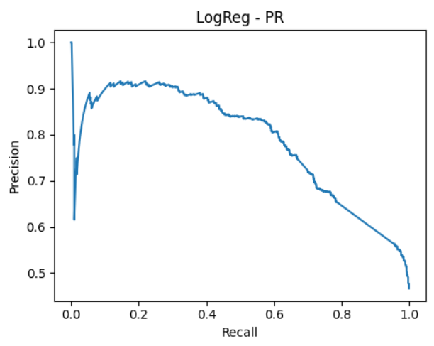
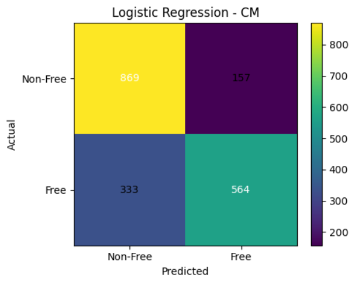
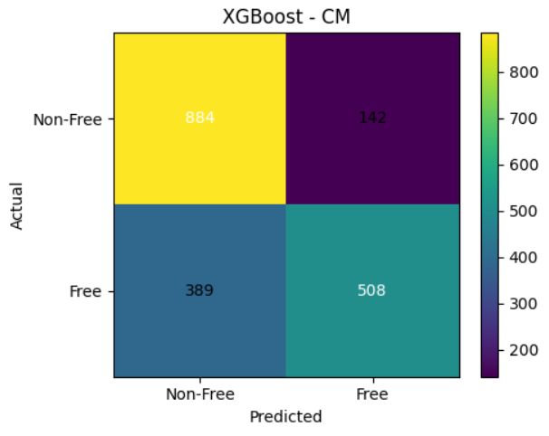
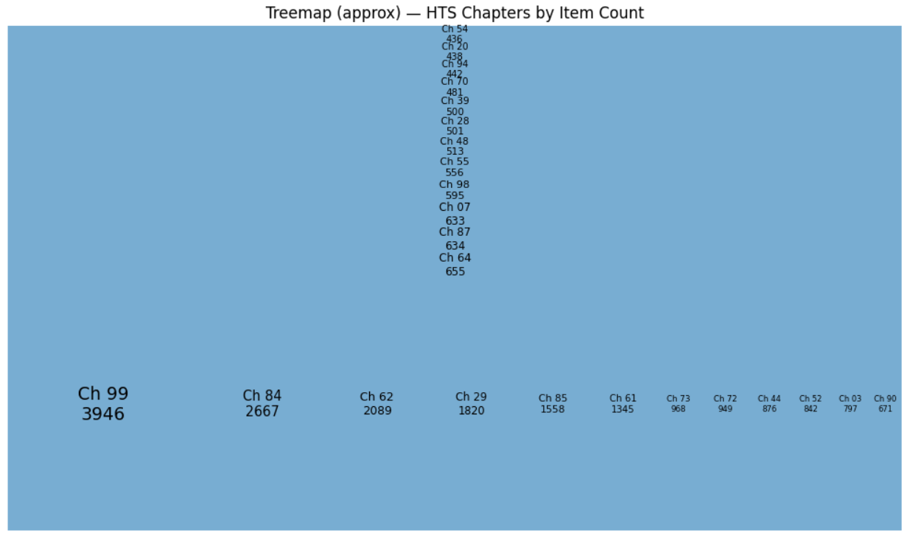
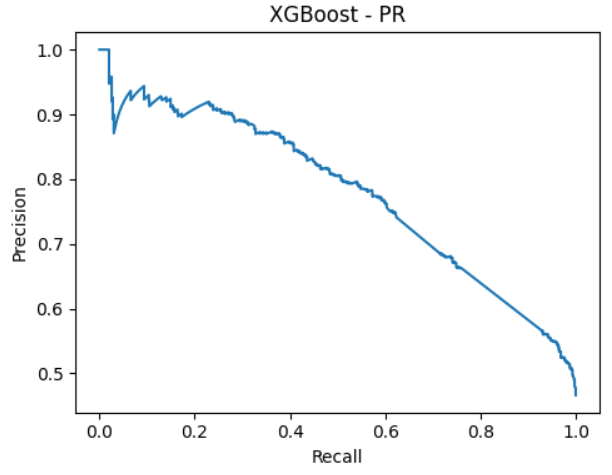
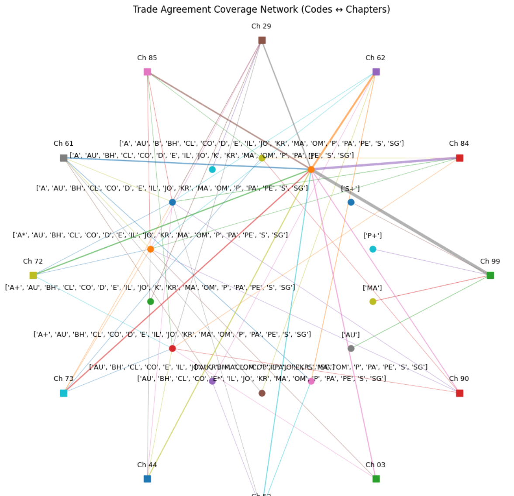
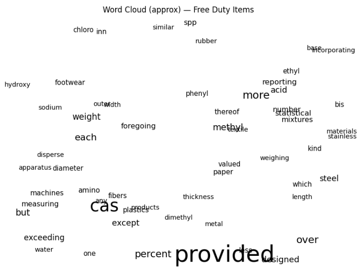

# HTS 2025 — Tariff Analytics & NLP

[](#)
[](#)
[](LICENSE)

> **Question.** Can free‑text **HTS descriptions** predict **tariff outcomes**?  
> **Answer.** Yes—text carries useful signal for **Free vs Non‑Free** (ROC‑AUC ≈ 0.8). Duty‑band boundaries are harder and benefit from sentence‑level embeddings.

---

## Contents
- [Overview](#overview)
- [Why these models](#why-these-models)
- [Results](#results)
- [Conclusions](#conclusions)
- [Figures (labeled)](#figures-labeled)
- [Reproducibility](#reproducibility)
- [Repository layout](#repository-layout)
- [Limitations](#limitations)

## Overview
This repository provides a reproducible, **CPU‑friendly** pipeline over the U.S. Harmonized Tariff Schedule (HTS 2025):

- **Preprocessing:** fill hierarchical codes, normalize duty text to numeric, extract special‑rate codes.
- **EDA:** chapter and indent distributions; duty histograms; missingness.
- **Binary classification (Free vs Non‑Free):** TF‑IDF + Logistic Regression / XGBoost.
- **Duty bands (3‑class, optional):** Sentence embeddings (MiniLM) + multinomial Logistic Regression.

> [!NOTE]
> The intent is **transparent baselines** that run quickly without GPUs. Transformer fine‑tuning is documented as future work, not a requirement.

## Why these models
- **Logistic Regression (TF‑IDF).** Strong, interpretable baseline for high‑dimensional sparse text; fast to train and easy to explain.
- **XGBoost (TF‑IDF).** Adds non‑linear decision boundaries and interactions on top of TF‑IDF; competitive when signal is subtle.
- **Sentence Embeddings + Logistic Regression.** For **3‑class duty bands**, bag‑of‑words misses context (e.g., chemical synonyms, multi‑word expressions). MiniLM embeddings capture semantics while staying CPU‑friendly.

> [!TIP]
> Presenting **two classical baselines** shows methodological judgment: start from interpretable linear models and escalate only when justified.

## Results
| Model | Accuracy | F1 | ROC‑AUC |
|---|---:|---:|---:|
| LogisticRegression | 0.745 | 0.697 | 0.813 |
| XGBoost | 0.724 | 0.657 | 0.796 |


> [!IMPORTANT]
> Thresholds can be adjusted per risk tolerance. For triage workflows, maximizing **recall for Non‑Free** may be preferable; include an operating‑point note in deployments.

## Conclusions
1. **Text → Tariff Signal.** Descriptions alone deliver **useful discrimination** for Free vs Non‑Free (AUC ≈ 0.8).  
2. **Ambiguity near zero.** Most errors sit at the Free/low‑duty boundary; incorporate structured features (materials, legal notes, origins) for finer separation.  
3. **Policy asymmetry.** Column 2 rates are consistently higher; any deployment should clearly state jurisdictional scope and disclaim compliance use.  
4. **Portfolio value.** The project demonstrates problem framing, data cleaning, baselines, evaluation, interpretability, visualization, and packaging.

---

## Figures (labeled)
### Binary models
<table>
<tr>
  <td align="center"><br><b>Fig. 1.</b> Logistic Regression — Confusion Matrix</td>
  <td align="center"><br><b>Fig. 2.</b> XGBoost — Confusion Matrix</td>
</tr>
<tr>
  <td align="center"><br><b>Fig. 3.</b> Logistic Regression — ROC</td>
  <td align="center"><br><b>Fig. 4.</b> XGBoost — ROC</td>
</tr>
<tr>
  <td align="center"><br><b>Fig. 5.</b> Logistic Regression — PR</td>
  <td align="center"><br><b>Fig. 6.</b> XGBoost — PR</td>
</tr>
</table>

### EDA and coverage
<table>
<tr>
  <td align="center"><br><b>Fig. 7.</b> Chapters by item count</td>
  <td align="center"><br><b>Fig. 8.</b> Avg general duty by chapter</td>
</tr>
<tr>
  <td align="center"><br><b>Fig. 9.</b> Words associated with Free items</td>
  <td align="center"><br><b>Fig. 10.</b> Special‑rate codes × chapters</td>
</tr>
</table>

> [!NOTE]
> Word clouds here are approximate, collision‑lightweight visuals meant for **qualitative** inspection, not statistical inference.

## Reproducibility
```bash
pip install -r requirements.txt

# 1) EDA
python scripts/eda.py

# 2) Baselines (Free vs Non‑Free)
python scripts/model_baseline.py
# artifacts: artifacts/model_summary.csv
# figures: figures/*lr_*.png, figures/*xgb_*.png

# 3) Duty bands (optional, CPU)
python scripts/embeddings_duty_bands.py
# artifacts: artifacts/bands_fast_metrics.json
# figures: figures/bands_fast_confusion.png
```

## Repository layout
```
scripts/
  preprocess.py
  eda.py
  model_baseline.py
  embeddings_duty_bands.py
docs/
  Report.md
figures/           # labeled figures referenced above
artifacts/         # metrics saved by scripts
data/              # include clean_hts_2025.csv if available
```

## Limitations
> [!WARNING]
> This is an **educational analysis**, not a legal or compliance tool. Text‑only features omit legal notes, rulings, and provenance. Models require recalibration over time and across jurisdictions.

---
© 2025 • MIT License
